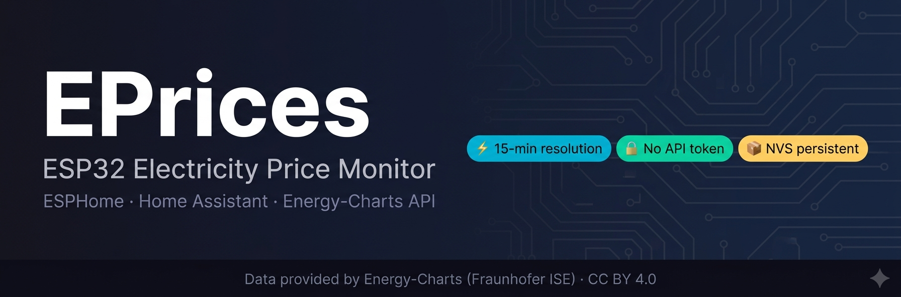

# EPrices

An ESPHome-based ESP32 firmware that fetches **day-ahead electricity spot prices**
from the public [Energy-Charts API](https://api.energy-charts.info) and exposes
them as Home Assistant sensors — with no cloud subscription, no API token, and
no external dependencies beyond your WiFi network.

All core logic runs entirely on the ESP32 — midnight bridge, boot recovery,
retry scheduling, and NVS persistence are all on-device. No external Home
Assistant automations are required for any core functionality.

---

## Features

- Fetches **15-minute resolution** spot prices for **today** and **tomorrow**
- Automatically applies your **provider fee** and **VAT rate** to raw €/MWh prices
- Exposes **96 per-day price points** plus **24-hour averages** as JSON text sensors
  for use in HA automations and dashboards
- **NVS persistence** — prices survive device reboots without re-fetching
- **Midnight bridge** — tomorrow's data automatically becomes today at 00:00, fully on-device
- **Auto-retry logic** — up to 8 HTTP fetch attempts for both today and tomorrow
- **DST-safe** — uses UNIX timestamps and binary search throughout, no hour-slot arithmetic
- **Staleness detection** — `Today Current Price Status` shows `Stale` if stored date mismatches today
- **Tomorrow live sensors** evaluate at `now + 86400s` — reflecting tomorrow at the same local time
- Supports **any Energy-Charts bidding zone** (SI, DE-LU, AT, FR, HR, HU and more)
- Full **diagnostic sensor suite** — NVS status, fetch attempts, API fetch times,
  data loaded times, WiFi signal, human-readable uptime
- Provider fee and VAT rate configurable via `secrets.yaml` — **no code changes needed**

---

## Hardware

- **ESP32** development board (tested on `esp32dev`)
- ESPHome with **`esp-idf` framework** (required for NVS flash support)

---

## Files

| File | Purpose |
|---|---|
| `eprices.yaml` | Main ESPHome configuration |
| `eprices_nvs.h` | NVS helper — save/load price arrays to ESP32 flash |
| `secrets.yaml` | Your local secrets (not committed to git) |
| `CHANGELOG.md` | Complete sensor and entity ID reference for v1.0 |
| `VERSION.md` | Version history and release notes |
| `ENTSO-E-PRICES-MIGRATION.md` | Optional — migration guide from the predecessor project |

---

## Installation

### 1) Clone or download this repository

### 2) Create your `secrets.yaml`

Place `secrets.yaml` in the same directory as `eprices.yaml`.
It must contain the following keys:

```yaml
wifi_ssid: "your_wifi_ssid"
wifi_password: "your_wifi_password"
eprices_fallback_ap_ssid: "EPrices-Fallback"
eprices_fallback_ap_password: "your_fallback_ap_password"
eprices_api_encryption_key: "your_base64_api_encryption_key_here"
eprices_timezone: "Europe/Ljubljana"
eprices_country_bzn: "SI"
eprices_prov_fee: "0.12"
eprices_vat_rate: "0.22"
```

**Key descriptions:**

| Key | Description |
|---|---|
| `eprices_timezone` | Your local timezone — must match a valid [IANA tz name](https://en.wikipedia.org/wiki/List_of_tz_database_time_zones) |
| `eprices_country_bzn` | Energy-Charts bidding zone code — see [supported zones](#supported-bidding-zones) |
| `eprices_prov_fee` | Provider fee as a decimal multiplier, e.g. `"0.12"` = 12% |
| `eprices_vat_rate` | VAT rate as a decimal multiplier, e.g. `"0.22"` = 22% |
| `eprices_api_encryption_key` | 32-byte base64 key for HA API encryption — generate with `openssl rand -base64 32` |

### 3) Flash to your ESP32

```bash
esphome run eprices.yaml
```

Or use the ESPHome Dashboard or the HA ESPHome add-on.

### 4) Add to Home Assistant

The device will appear automatically in HA via the ESPHome integration.
Accept the device and enter your API encryption key when prompted.

---

## Supported bidding zones

Any zone supported by the [Energy-Charts API](https://api.energy-charts.info)
`/price` endpoint. Common examples:

| Code | Zone |
|---|---|
| `SI` | Slovenia |
| `DE-LU` | Germany / Luxembourg |
| `AT` | Austria |
| `FR` | France |
| `IT-North` | Italy North |
| `HR` | Croatia |
| `HU` | Hungary |

For the full list see the [Energy-Charts API documentation](https://api.energy-charts.info).

---

## How it works

### Price fetch schedule

| Event | Action |
|---|---|
| Boot | Load today + tomorrow from NVS flash; HTTP fetch if NVS miss or stale |
| 00:00 midnight | Promote tomorrow → today; clear tomorrow; schedule tomorrow fetch if in window |
| 00:05, 00:15, 00:30, then hourly :30 | Auto-retry today fetch if previous attempt failed (max 8) |
| 13:25 | First auto-fetch attempt for tomorrow |
| 13:55, 14:55 … 19:55 | Retry tomorrow fetch if previous attempt failed (max 8 total) |
| Manual button press | Force immediate fetch for today or tomorrow |

### Price calculation

Raw prices from the API are in **€/MWh**. EPrices converts them to **€/kWh**
and applies your provider fee and VAT:

```
price_eur_kwh = (raw_eur_mwh / 1000) × (1 + prov_fee) × (1 + vat_rate)
```

### Negative prices

On days with high solar or wind generation, spot prices can go negative.
EPrices handles negative prices correctly throughout. In the 15-min JSON
sensors, negative values are formatted with 3 decimal places (e.g. `-0.057`)
instead of 4, to stay within the 255-character Home Assistant text sensor
state limit. Precision loss is at most 0.0001 €/kWh (0.01 cent).

### NVS persistence

Prices are stored in ESP32 NVS (non-volatile storage) under the `eprices`
namespace using dynamic timestamp + price arrays. On reboot, stored prices
are validated against today's and tomorrow's date before use. Stale data
is discarded and a fresh HTTP fetch is triggered automatically.

### DST safety

All price indexing uses UNIX timestamps and binary search. There is no
hour-slot arithmetic anywhere in the codebase, making the firmware fully
safe on DST transition days (23-hour and 25-hour days).

---

## Sensors

### Today — numeric

| Sensor | Entity ID | Description |
|---|---|---|
| Today Current Price | `sensor.eprices_today_current_price` | Current 15-min slot price €/kWh |
| Today Next Price | `sensor.eprices_today_next_price` | Next 15-min slot price €/kWh |
| Today Average Price | `sensor.eprices_today_average_price` | Average of all hourly prices €/kWh |
| Today Highest Price | `sensor.eprices_today_highest_price` | Highest 15-min price €/kWh |
| Today Lowest Price | `sensor.eprices_today_lowest_price` | Lowest 15-min price €/kWh |
| Today Current Hourly Price | `sensor.eprices_today_current_hourly_price` | Current hour average €/kWh |
| Today Next Hourly Price | `sensor.eprices_today_next_hourly_price` | Next hour average €/kWh |
| Today Highest Hourly Price | `sensor.eprices_today_highest_hourly_price` | Highest hourly average €/kWh |
| Today Lowest Hourly Price | `sensor.eprices_today_lowest_hourly_price` | Lowest hourly average €/kWh |
| Today Current Max Hourly Price Percentage | `sensor.eprices_today_current_max_hourly_price_percentage` | Current hour as % of daily max |

### Today — text

| Sensor | Entity ID | Description |
|---|---|---|
| Today JSON Hourly Prices EUR⁄kWh | `sensor.eprices_today_json_hourly_prices_eur_kwh` | JSON array of 24 hourly averages |
| Today JSON 15-Min Prices EUR⁄kWh (P1 00:00-07:45) | `sensor.eprices_today_json_15_min_prices_eur_kwh_p1_00_00_07_45` | JSON array of 32 prices |
| Today JSON 15-Min Prices EUR⁄kWh (P2 08:00-15:45) | `sensor.eprices_today_json_15_min_prices_eur_kwh_p2_08_00_15_45` | JSON array of 32 prices |
| Today JSON 15-Min Prices EUR⁄kWh (P3 16:00-23:45) | `sensor.eprices_today_json_15_min_prices_eur_kwh_p3_16_00_23_45` | JSON array of 32 prices |
| Today Highest Price Time | `sensor.eprices_today_highest_price_time` | Time of highest 15-min price (HH:MM) |
| Today Lowest Price Time | `sensor.eprices_today_lowest_price_time` | Time of lowest 15-min price (HH:MM) |
| Today Highest Hourly Price Time | `sensor.eprices_today_highest_hourly_price_time` | Time of highest hourly average (HH:00) |
| Today Lowest Hourly Price Time | `sensor.eprices_today_lowest_hourly_price_time` | Time of lowest hourly average (HH:00) |
| Today Current Price Status | `sensor.eprices_today_current_price_status` | `Valid` / `Missing` / `Stale` |
| Today Data Loaded Time | `sensor.eprices_today_data_loaded_time` | Last time today data entered memory (NVS or HTTP) |

### Tomorrow — numeric

| Sensor | Entity ID | Description |
|---|---|---|
| Tomorrow Current Price | `sensor.eprices_tomorrow_current_price` | Tomorrow at same local time as now |
| Tomorrow Next Price | `sensor.eprices_tomorrow_next_price` | Tomorrow next 15-min slot |
| Tomorrow Average Price | `sensor.eprices_tomorrow_average_price` | Average of all hourly prices €/kWh |
| Tomorrow Highest Price | `sensor.eprices_tomorrow_highest_price` | Highest 15-min price €/kWh |
| Tomorrow Lowest Price | `sensor.eprices_tomorrow_lowest_price` | Lowest 15-min price €/kWh |
| Tomorrow Current Hourly Price | `sensor.eprices_tomorrow_current_hourly_price` | Tomorrow same hour average €/kWh |
| Tomorrow Next Hourly Price | `sensor.eprices_tomorrow_next_hourly_price` | Tomorrow next hour average €/kWh |
| Tomorrow Highest Hourly Price | `sensor.eprices_tomorrow_highest_hourly_price` | Highest hourly average €/kWh |
| Tomorrow Lowest Hourly Price | `sensor.eprices_tomorrow_lowest_hourly_price` | Lowest hourly average €/kWh |
| Tomorrow Current Max Hourly Price Percentage | `sensor.eprices_tomorrow_current_max_hourly_price_percentage` | Same-time hour as % of tomorrow max |

### Tomorrow — text

| Sensor | Entity ID | Description |
|---|---|---|
| Tomorrow JSON Hourly Prices EUR⁄kWh | `sensor.eprices_tomorrow_json_hourly_prices_eur_kwh` | JSON array of 24 hourly averages |
| Tomorrow JSON 15-Min Prices EUR⁄kWh (P1 00:00-07:45) | `sensor.eprices_tomorrow_json_15_min_prices_eur_kwh_p1_00_00_07_45` | JSON array of 32 prices |
| Tomorrow JSON 15-Min Prices EUR⁄kWh (P2 08:00-15:45) | `sensor.eprices_tomorrow_json_15_min_prices_eur_kwh_p2_08_00_15_45` | JSON array of 32 prices |
| Tomorrow JSON 15-Min Prices EUR⁄kWh (P3 16:00-23:45) | `sensor.eprices_tomorrow_json_15_min_prices_eur_kwh_p3_16_00_23_45` | JSON array of 32 prices |
| Tomorrow Highest Price Time | `sensor.eprices_tomorrow_highest_price_time` | Time of highest 15-min price (HH:MM) |
| Tomorrow Lowest Price Time | `sensor.eprices_tomorrow_lowest_price_time` | Time of lowest 15-min price (HH:MM) |
| Tomorrow Highest Hourly Price Time | `sensor.eprices_tomorrow_highest_hourly_price_time` | Time of highest hourly average (HH:00) |
| Tomorrow Lowest Hourly Price Time | `sensor.eprices_tomorrow_lowest_hourly_price_time` | Time of lowest hourly average (HH:00) |
| Tomorrow Current Price Status | `sensor.eprices_tomorrow_current_price_status` | `Valid` / `Missing` / `Waiting...` |
| Tomorrow Data Loaded Time | `sensor.eprices_tomorrow_data_loaded_time` | Last time tomorrow data entered memory; `Outside fetch window` before 13:20 |

### Diagnostic

| Sensor | Entity ID | Description |
|---|---|---|
| Last Reboot | `sensor.eprices_last_reboot` | Timestamp of last device boot |
| Uptime | `sensor.eprices_uptime` | Human-readable: `45 s` / `5 min` / `3 h 22 min` / `12 d 4 h` / `4 months 12 d` |
| WiFi Signal | `sensor.eprices_wifi_signal` | RSSI in dBm, updated every 60s |
| Last Update Source | `sensor.eprices_last_update_source` | `NVS_boot` / `HTTP_today` / `midnight_bridge` / `NVS_api` etc. |
| Today Data Date | `sensor.eprices_today_data_date` | Date of currently stored today data |
| Tomorrow Data Date | `sensor.eprices_tomorrow_data_date` | Date of currently stored tomorrow data |
| Today Entry Count | `sensor.eprices_today_entry_count` | Number of price points stored for today |
| Tomorrow Entry Count | `sensor.eprices_tomorrow_entry_count` | Number of price points stored for tomorrow |
| Today NVS Status | `sensor.eprices_today_nvs_status` | NVS load/store result for today |
| Tomorrow NVS Status | `sensor.eprices_tomorrow_nvs_status` | NVS load/store result for tomorrow |
| Today Last API Fetch Time | `sensor.eprices_today_last_api_fetch_time` | Timestamp of last successful HTTP fetch for today; `Never` if NVS only |
| Tomorrow Last API Fetch Time | `sensor.eprices_tomorrow_last_api_fetch_time` | Timestamp of last successful HTTP fetch for tomorrow; `Never` if NVS only |
| Today API Fetch Attempts | `sensor.eprices_today_api_fetch_attempts` | HTTP fetch attempt count for today; resets at midnight |
| Tomorrow API Fetch Attempts | `sensor.eprices_tomorrow_api_fetch_attempts` | HTTP fetch attempt count for tomorrow; resets at 13:25 |
| Today Price Update Status | `sensor.eprices_today_price_update_status` | `SUCCESS` / `FAILED/WAITING` |
| Tomorrow Price Update Status | `sensor.eprices_tomorrow_price_update_status` | `SUCCESS` / `FAILED/WAITING` |
| Today Price Update Status Message | `sensor.eprices_today_price_update_status_message` | Detailed status string |
| Tomorrow Price Update Status Message | `sensor.eprices_tomorrow_price_update_status_message` | Detailed status string |

### Buttons

| Button | Entity ID | Description |
|---|---|---|
| Force Today's Update | `button.eprices_force_today_s_update` | Trigger immediate today HTTP fetch |
| Force Tomorrow's Update | `button.eprices_force_tomorrow_s_update` | Trigger immediate tomorrow fetch (window: 13:20–23:50) |
| Reboot Device | `button.eprices_reboot_device` | Restart the ESP32 |

---

## Migrating from entso-e-prices

If you are migrating from the predecessor project entso-e-prices v4.3.1,
see [ENTSO-E-PRICES-MIGRATION.md](ENTSO-E-PRICES-MIGRATION.md) for the
complete rationale, all sensor rename mappings, and a migration checklist.

---

## Data attribution

Electricity price data provided by
**[Energy-Charts](https://energy-charts.info)** (Fraunhofer ISE)
via the [Energy-Charts API](https://api.energy-charts.info),
licensed under [CC BY 4.0](https://creativecommons.org/licenses/by/4.0/).

---

## License

This project (ESPHome YAML and C++ helper) is released under the
[MIT License](LICENSE).
